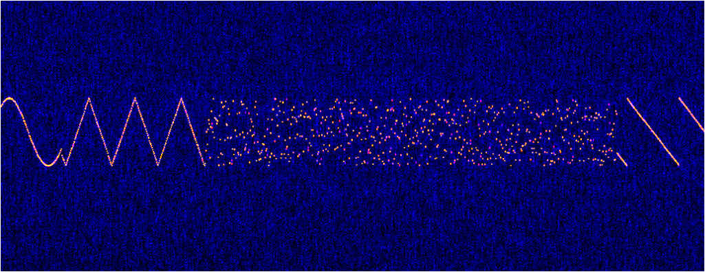
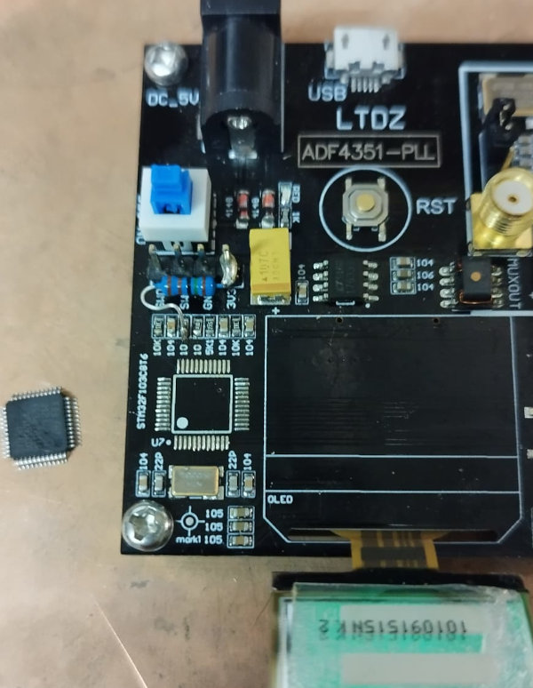

# ADF4351-USB-Serial

USB serial driven ADF4351 signal generator for Physics, Electronics Lab Test, RF Signal Experimentation
and (CW / HF / Morse Code) Ham Radio.



## Recently added or updated 🆕 ✨
- [Added script to use with multiple signal generators](scripts/net_multiple_serial.sh)[21st July,2023]
- [Added HW Serial](src/brd_ltdz_stm32f103cb.cpp)[19th July,2023]
- [Example glide modulation](images/exponential_glides.jpg)[14th July,2023]
- [Added an interactive text to Morse Code CW RF key mode](src/morse_code.cpp)[15th July,2023]

## Introduction
This project arose from a requirement to run multiple frequency generators in parallel for a quantum physics experiment without resorting to a rack of signal generators. The low cost LTDZ ADF4351-PLL board was chosen as a source however, the default firmware did not provide the required USB-serial control, only keypad and OLED manual control. Some hardware mods were required to fix the USB interface and upgrade the microcontroller to one with same pin out and larger Flash memory. Extensive sets of modulation functions were written to provide dynamic control of the synthesizer output. 

The usb serial interface implements a very simple set of text commands which can be used either manually or programmatically from a script.

To make the firmware also useful for HAM radio and amateur radio enthusiasts, a morse code mode is added to directly key the RF output of the signal generator with text provided over the USB-serial interface.


## Hardware mods to the LTDZ board


1. An extra 1.5kohm resistor was required as a pull-up on the D+ USB line to 3.3V. 
2. A 4 lead pin header is soldered for the ST-Link firmware updates.
3. The STM32F1038t requires reflow work to swap out the stm32f103c6t6 (32 kBytes) with the larger flash memory STM32F103CBT6 chip (128kBytes) 

## Hardware mods to the LTDZ board for 3.3V RS232
The RPI and USB3.0 adapters struggle with the STM32 USB, so additional duplication of the terminal and command features were added using Hardware Serial. Fortunately Serial2 is configured to use pins PA3(RX) and  PA2(TX). These correspond to the keypad pins Down=Rx and Select=Tx. This allows easy access to those 3.3V RS232 by soldering a pin to the switch. An FTDI USB-serial 3pin adapter can then be used to connect the ADF4351 signal generator to an RPI without worrying about USB compatability. 
It is suspected that STM32F103 USB compatability is due either to having a constant pullup on D+ and not a software controlled pullup as per the Bluepill and the MapleMini, or it could be that the 8MHz clock for the micro is not to the required specification for generating the USB clocks? The work around is to use 3 pin serial. 

## Use on other hardware
It is suspected that this firmware could be easily be adapted for use on the devices sold as "Spectrum Analyzer USB 35-4400M Signal Source with Tracking Source Module RF Frequency Analysis Tool Support NWT4" as these have the ADF4351 as the output RF signal generator and also incorporate a larger ST32F103 microcontroller with USB interface. Further testing is required. It may be just as simple as modifying the SPI pins. The changes to support 3 pin serial should help with this port as the Signal tracking source also uses an FTDI chip rather than relying on USB serial from the STM32.


## Features
+ Triangle, Ramp, Sine wave and stochastic noise frequency modulation with a low frequency oscillator (LFO)
+ Optional linear or exponential frequency glide
+ Amplitude and phase control
+ Simulated 16 bit sigma delta amplitude modulation
+ Enable/disable RF output
+ Algorithms for selecting frequencies using either highest common dividor or by searching multiple channel space tables
+ Direct text to morse code keying of the signal generator at 5 WPM up to 120 WPM! 

## Commands 
The usb serial commands are very simple in that they are each a letter followed by a number or a set of words. The commands are as follows:

```console
H: ADF4351 STM32F103CB Help->
A: Set amplitude                     (0-4)
D: Disable RF
E: Enable RF
F: Set frequency                     (35000000 - 4400000000 Hz)
G: Glide Time                        (0-2000 ms)
J: Exponential Glide Time            (0-2000 ms)
I: Frequency information
L: Set linear frequency ramp         (0=stop, or: -/+____ Hz)
M: Morse Code                        (string)
O: Set triangle frequency modulation (0=stop, or: -/+____ Hz)
P: Set phase angle                   (0.0-360.0 deg.)
R: Register information
S: Set sinewave frequency modulation (0=stop, or: -/+____ Hz)
W: Morse Code words per minute       (5-120 WPM)
X: Modulation LFO Speed              (1-1024)
Y: Set sigma-delta amplitude         (-1=stop, or: 0-65535)
Z: Set random frequency modulation   (0=stop, or: -/+____ Hz)
```

## Example commands
Ensure to run the signal generator into a 50 ohm test load. The output can be observed with an oscilloscope, a spectrum analyser or an SDR receiver using appropriate selected RF pickup or RF attenuators. 

Here is an example usage of the commands that can be used from the usb serial terminal:

```console
#Help menu
H
#Set frequency
F64000000
#Enable RF
E
#Amplitude +5dBm
A3
#Amplitude -4dBm
A0
#Enable linear glide
G1000
#Switch frequency
F63000000
#Output current settings
I
#Switch to exponential glide
J10000
#Switch frequency
F63500000
#Disable glide
J0
#Enable sinewave with 100kHz modulation width
S100000
#Switch to triangle modulation with 100kHz modulation width
O100000
#Reduce modulation depth to 10kHz
O10000
#Switch to linear (sawtooth) modulation
L100000
#Switch to stochastic modulation
Z100000
#Reduce stochastic modulation to 10kHz bandwidth
Z10000
#Switch back to 100kHz sinewave modulation
S100000
#Increase the modulation LFO frequency
X10
#Observe fast LFO modulations
X256
X512
X1024
X500
#Key the RF output with a morse sequence
M Hello test message
#Change Morse Code speed
X8
#Retest morse key
M Slower test message
```


# Compilation
The code is compiled with Visual Studio Code with Platform.IO

The compiled firmware is supplied for use with ST-LINK tools


# References and Acknowledgement
This project is built upon the great work and the shoulders of others:

+ [siggen4351 Arduino Signal Generator using ADF4351](https://github.com/dfannin/siggen4351) by David Fannin
+ [Big Number Arduino Library](https://github.com/nickgammon/BigNumber) by Nick Gammon
+ [bitBangedSPI Lbrary](https://github.com/nickgammon/bitBangedSPI) by Nick Gammon
+ [SV1AFN ADF4351 Board](https://www.sv1afn.com/adf4351m.html) by Makis Katsouris, SV1AFN
+ [STM32 Bluepill Setup](https://github.com/rpakdel/stm32_bluepill_arduino_prep) by Reza Pakdel
+ [Schematics of a similar board](https://img.elecbee.com/ic/download/pdf/20190731013337STM32-ADF4351.pdf) Elecbee PCB 
+ [ADF4351 Product Page](https://goo.gl/tkMjw6) Analog Devices
+ [ADF4351 Datasheet](https://www.analog.com/media/en/technical-documentation/data-sheets/ADF4351.pdf)  Analog Devices


